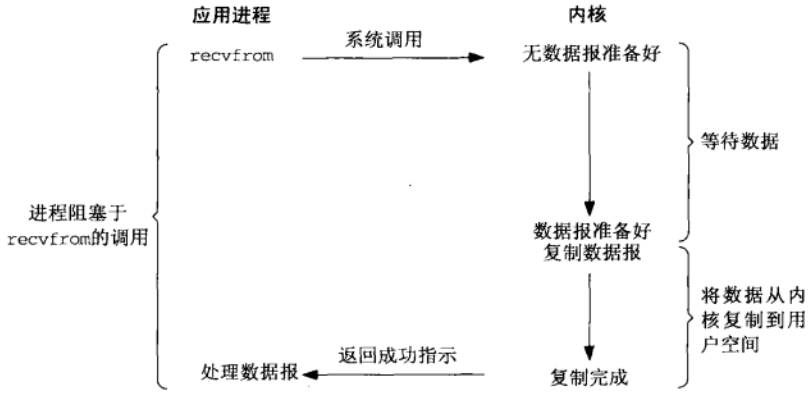
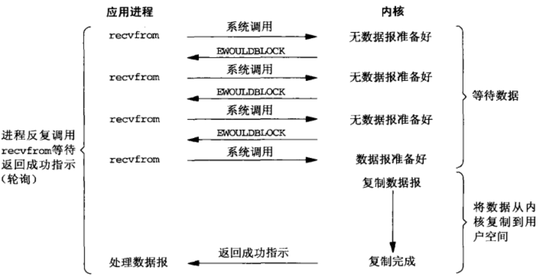
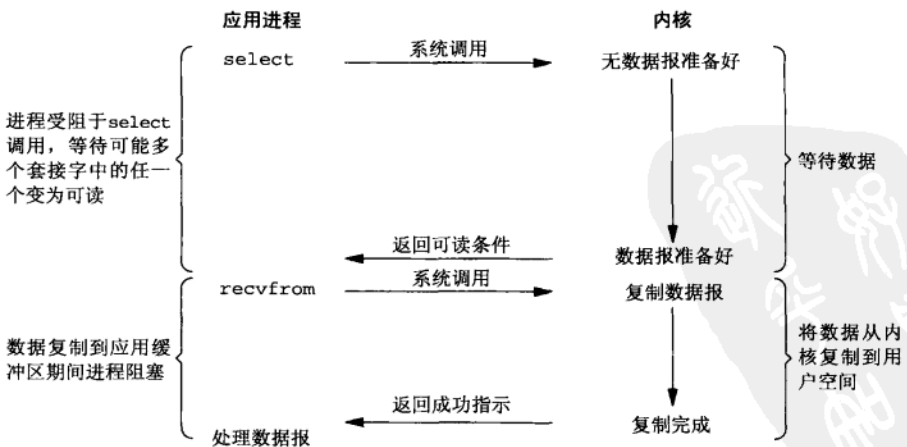
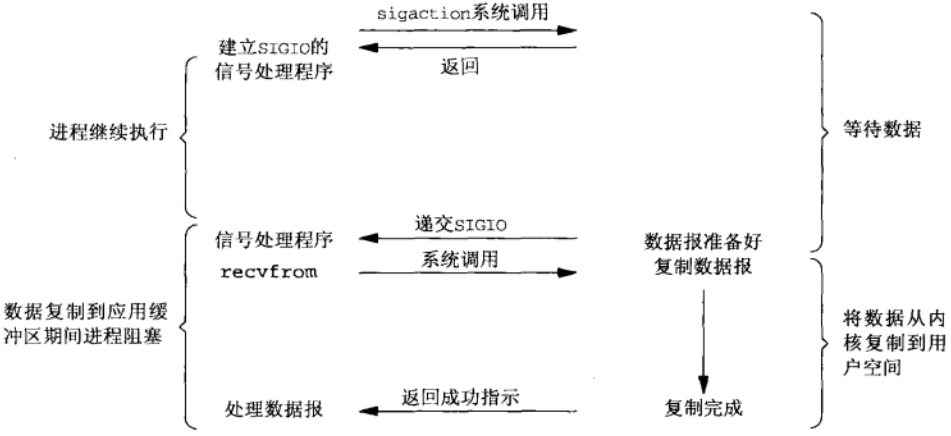
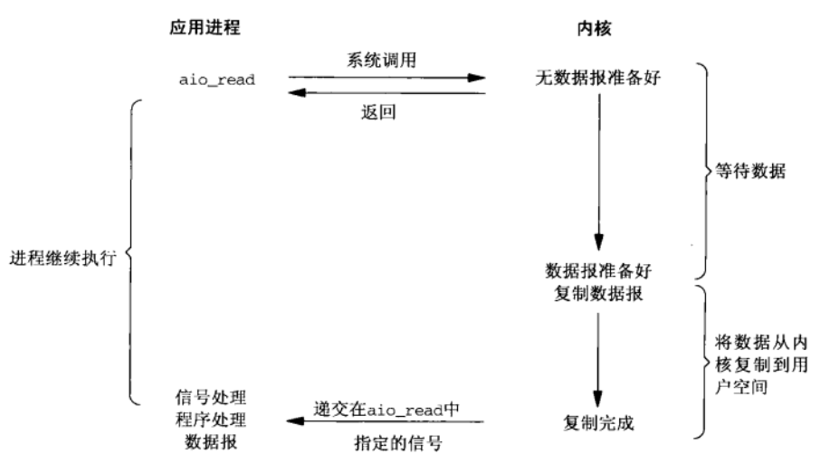
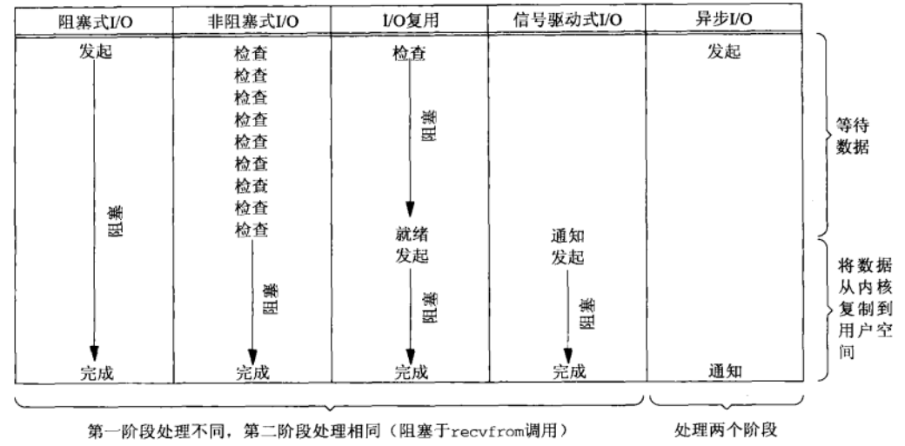
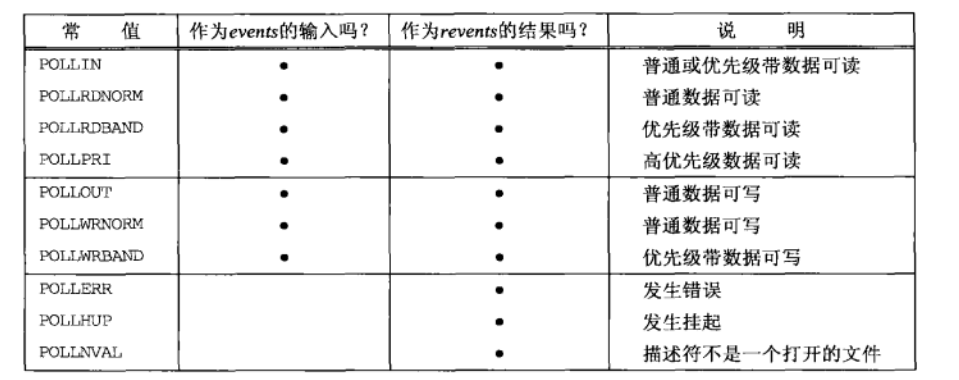

# IO复用
## IO模型
+ 阻塞IO
+ 非阻塞IO
+ 复用IO
+ 信号驱动IO(SIGIO)
+ 异步IO
==前四种成为同步IO==

一个输入操作通常包括两个不同的阶段：
1. 等待数据准备好；
2. 从内核向进程复制数据。

### 阻塞IO
最常用的IO模型是阻塞IO模型。默认情况下，所有跟套接字都是阻塞的。阻塞IO模型如下图所示：

图中，进程调用`recvfrom`，其系统调用直到数据报到达且被复制到应用进程的缓冲区中或者发生错误才返回。最常见的错误是系统调用被信号中断。所以说进程在从调用`recvfrom`开始到它返回的整段时间内是被阻塞的。recvfrom成功返回后，应用进程开始处理数据。
### 非阻塞IO
进程把一个套接字设置成为非阻塞是在通知内核：当所请求的IO操作非得把本进程投入睡眠才能完成时，不要把本进程投入睡眠，而是返回一个错误。非阻塞IO模型如下：

前三次调用`recvfrom`时没有数据可返回，因此内核转而立即返回一个`EWOULDBLOCK`错误。第四次调用`recvfrom`时已有一个数据报准备好，它被复制到应用进程缓冲区，于是`recvfrom`成功返回。
当一个应用进程像这样对一个非阻塞描述符循环调用`recvfrom`时，称之为**轮询**。应用进程持续轮询内核，以查看某个操作是否就绪，这样做会耗费大量CPU事件，通常用于专门提供某一功能的系统中。

**阻塞与非阻塞**：描述的是用户线程调用内核IO操作的方式，阻塞是指IO操作需要彻底完成后才返回用户空间；而非阻塞是指IO操作被调用后立即返回给用户一个状态值，无需等到IO操作彻底完成。

### 复用IO
有了IO复用，我们可以调用`select`、`poll`或`epoll`，阻塞在这两个系统调用中的某一个之上，而不是阻塞在真正的IO系统调用上。复用IO模型如下图：

我们阻塞于`select`调用，等待数据报套接字变为可读。当select返回套接字可读这一条件时，调用`recvfrom`把所有数据报复制到应用进程缓冲区。
==与复用IO密切相关的另一种IO模型时在多线程中使用阻塞IO。==
### 信号驱动IO
让内核在描述符就绪时发送SIGIO信号通知我们。模型如下图。

首先开启套接字的信号驱动IO功能，并通过`sigaction`系统调用安装一个信号处理函数。该系统调用讲立即返回，我们的进程继续工作，也就是说它没有被阻塞。当数据报准备好读取时，内核就为该进程产生一个`SIGIO`信号。我们随后既可以在信号处理函数中调用`recvfrom`读取数据报，并通知主循环数据已准备好待处理，也可以立即通知主循环，让它读取数据报。
无论如何处理`SIGIO`信号，这种模型的优势在于等待数据报到达期间进程不被阻塞。主循环可以继续执行，只要等待来自信号处理函数的通知：既可以是数据已准备好可以被处理，也可以时数据报已准备好可以被读取。
###异步IO
告知内核启动某个操作，并让内核在整个操作(包括将数据从内核复制到我们自己的缓冲区)完成后通知我们。这种模型==与信号驱动模型的主要区别在于：信号驱动IO**由内核通知我们何时可以启动一个IO操作**,而异步IO是**由内核通知我们IO操作何时完成**。==异步IO模型如图：

我们调用`aio_read`函数（POSIX异步IO函数以aio_或lio_开头），给内核传递描述符、缓冲区指针、缓冲区大小和文件偏移，并告诉内核当整个操作完成时如何通知我们。该系统调用立即返回，而且在等待IO完成期间，我们的进程不被阻塞。
### 各种IO模型的比较
下图对比了上述5种不同的IO模型，可已看出，前4种模型的主要区别在于第一个阶段，因为他们的第二个阶段是一样的：在数据从内核复制到调用这的缓冲区间，进程阻塞与`recvfrom`调用。相反，异步IO模型咋这两个阶段都要处理，从而不同于其他4种模型。

### 同步IO与异步IO对比
描述的是用户进程与内核的交互方式。

+ **同步IO操作**：用户进程发起IO数据请求后需要等待或者轮训内核IO操作完成后才能继续执行；
+ **异步IO操作**：用户进程发起IO操作后任然继续执行，当内核IO操作完成后会通知用户进程或调用用户进程注册的回调函数。


## 复用IO
### select函数
该函数允许进程只是内核等待多个事件中的任何一个发生，并且只有一个或对个事件发生或经历一段指定的时间后才唤醒它。也就是说，我们调用`select`告知内核对哪些描述符感兴趣以及等待多长时间。这里的描述符不局限于套接字，任何描述符多可以使用`select`来测试。
```
#include <sys/select.h>
#include <sys/time.h>
int select(int nfds, fd_set *readfds, fd_set *writefds, fd_set *exceptfds, struct timeval *timeout);
返回：若有就绪描述符则为其数目，若超时则为0，若出错则为-1.
```
参数`timeout`告诉内核等待所指定描述符中任何一个就绪可以花多长时间。其`timeval`机构用于指定这段时间的秒数和微秒数。
```
struct timeval {
	long tv_sec;
	long tv_usec;
};
```
这个参数有一下三种可能：
1. 永远等待下去：仅 有描述符准备好IO时才返回。为此，可以把该参数设置为空指针。
2. 等待一段固定时间：在有描述符准备好IO时才返回，但是不超过有该参数所指向`timeval`结构中指定的秒数和微秒数。
3. 根本不等待：检查描述符后立即返回，这成为**轮训**，为此，该参数必须指向一个`timeval`结构，而且其中的定时器值必须为0;。

参数`readfds`、`writefds`、`exceptfds`指定我们要让内核测试读、写和异常条件的描述符。目前支持的异常条件只有两个：
1. 某个套接字的外带数据的到达；
2. 某个已置为分组模式的伪终端灿在可从其主端读取的控制状态信息。
```
void FD_CLR(int fd, fd_set *set);
int  FD_ISSET(int fd, fd_set *set);
void FD_SET(int fd, fd_set *set);
void FD_ZERO(fd_set *set);
```
我们分配fd_set数据类型的描述集，并用这些宏设置或测试该集合中的每一位。描述集的初始化十分重要。
`select`函数的中间三个参数`readfds`、`writefds`、`exceptfds`中，如果我们对某个的条件不感兴趣，就可以把他设置位空指针。如果三个都为空指针，那么就有了一个比`sleep`函数更为精确的定时器。
`nfds`参数指定待测试的描述符的个数，它的值时待测试的最大描述符加1。
#### 描述符就绪条件
+ 满足下列四个条件的任何一个时，一个套接字准备好**读**。
    1. 该套接字接受缓冲区中的数据字节数大于等于套接字缓冲区低水位标记的当前大小。对于这样的套接字执行读操作不会阻塞并将返回一个大于0的值。我们可以使用`SO_RCVLOWAT`套接字选项设置该套接字的低水位标记，对于TCP和UDP套接字而言，其默认值为1.
    2. 该链连接的读半部关闭(也就是接受了`FIN`的TCP连接)。对于这样的套接字的读操作将不阻塞并返回0(也就是返回EOF).
    3. 其上有一个监听套接字且已完成的连接数不为0.对于这样的套接字的`accept`通常不会阻塞。
    4. 其上有一个套接字错误待处理。对这样的套接字的读操作将不阻塞并返回-1，同时把`error`设置成确切的错误条件。这些待处理错误也可以通过指定`SO_ERROR`套接字选项调用`getsockopt`获取并清除。
+ 下列四个条件中的任何一个满足时一个套接字准备好**写**。
    1. 该套接字返送缓冲区的可用空间字节数大于等于套接字发送缓冲区低水位标记的当前大小，并且或者该套接字已连接，或者该套接字不需要连接(UDP套接字)。这意味着如果我们把这样的套接字设置成非阻塞，写操作将不会阻塞并返回一个正值。我们可以使用`SO_SENLOWAT`套接字选项来设置该套接字的低水位标记。对于TCP和UDP套接字而言，其默认值通常为2048.
    2. 该连接的写半部关闭。对于这样的套接字的下操作将产生`SIGPIPE`信号。
    3. 使用非阻塞式`connect`的套接字已建立连接，或者`connect`已经一失败告终。
    4. 其上有一个套接字错误待处理。对于这样的套接字的写操作将不阻塞并返回-1，同时把`error`设置成确切的错误条件。这些待处理错误也可以通过指定`SO_ERROR`套接字选项调用`getsockopt`获取并清除。

==注意：当某个套接字上发生错误时，它将有`select`标记为既可读又可写。==
**接收低水位**和**发送低水位**的目的在于：允许应用进程控制在`select`返回可读或可写条件之前有多少数据可读或有多大空间可用于写。例如：如果我们知道除非至少存在64个字节的数据，否则我们的应用进程没有任何有效的工作可做，那么可以把接收低水位标记设置为64，以防少于64字节的数据准备好时`select`唤醒我们。
#### pselect函数
```
#include <sys/select.h>

int pselect(int nfds, fd_set *readfds, fd_set *writefds,
                   fd_set *exceptfds, const struct timespec *timeout,
                   const sigset_t *sigmask);
返回：若有就绪描述符则为其数目，若超时则为0，若出错则为-1.
```
`pselect`相对于`select`有两个变化：
   1. `pselect`使用`timespec`结构，而不使用`timeval`结构。
```
struct timespec {
	long    tv_sec;         /* seconds */
	long    tv_nsec;        /* nanoseconds */
};
```
这两个结构的区别在于第二个成员：新结构的该成员tv_nsec指定纳秒数，而旧结构的该成员tv_usec指定微秒数。
   2. `pselect`函数增加了第六个参数：一个指向信号掩码的指针。该参数允许程序先禁止递交某些信号，在测试由这些当前被禁止信号的信号处理函数设置的全局变量，然后调用`pselect`，告诉它重新设置信号掩码。
### poll函数
poll提供的功能与select类似，不过在处理流设备时能够提供额外的信息。
```
#include <poll.h>
int poll(struct pollfd *fds, nfds_t nfds, int timeout);
返回：若有就绪描述符则为其数目，若超时则为0，若出错则为-1.
```
第一个参数指向一个结构体数组的第一个元素。每个元素都是一个结构体数组第一个元素的指针。每个数组元素都是一个`pollfd`结构，用于指定测试某个给定描述符fd的条件。
```
struct pollfd {
	int   fd;         /* file descriptor */
	short events;     /* requested events */
	short revents;    /* returned events */
};
```
要测试的条由`events`成员指定，函数在相应的`revents`成员中返回该描述符的状态（每个描述符都有两个变量，一个为调用值，一个为返结果），从而避免使用值-结果参数。下表列出用于指定`events`标志以及`revents`标志的一些常值。

该表可以分为三个部分：第一部分是处理输入的四个常值，第二部分是处理输出的三个常值，第三部分是处理错误的三个常值。其中第三部分的三个常值不能在`events`中设置，但是当条件存在时就在`revents`中返回。
`poll`识别三类数据：普通(normal)，优先级带(priority band)，高优先级(high priority)。

`nfds`指定结构数组中元素的个数。
`timeout`参数指定`poll`函数的等待时间。它的取值如下：

|timeout值|说明|
|-|-|
|INFTIM| 永远等待|
|0|立即返回，不阻塞进程|
|>0|等待指定时长|

`INFTIM`常值被定义为一个负值。
如果我们不再关系某个特定描述符，那么可以把与它对应的`pollfd`结构的`fd`成员设置成一个负值，`poll`函数将忽略这样的`pollfd`结构的`events`成员，返回时将它的`revents`成员的值置为0。

### epoll
为处理大批量句柄而作了改进的`poll`。要使用`epoll`只需要这三个系统调用：`epoll_create`、`epoll_ctl`、`epoll_wait`。

```
#include <sys/epoll.h>

int epoll_create(int size);
```
创建一个`epoll`句柄，`size`参数会被忽略，但必须大于0，目的是为了兼容。当创建好`epoll`句柄后，它就会占用一个fd值，所以在使用完epoll后必须调用`close`关闭，否则可能导致fd被耗尽。

```
#include <sys/epoll.h>

int epoll_ctl(int epfd, int op, int fd, struct epoll_event *event);
```
epoll的事件注册函数，第一个参数是`epoll_create`的返回值，第二个参数表示动作，用三个宏来表示：
```
EPOLL_CTL_ADD：注册新的fd到epfd中；
EPOLL_CTL_MOD：修改已经注册的fd的监听事件；
EPOLL_CTL_DEL：从epfd中删除一个fd。
```
第三个参数时要监听的fd，第四个参数时告诉内核需要监听什么事，`struct epoll_event`结构如下：
```
typedef union epoll_data {
	void        *ptr;
	int          fd;
	uint32_t     u32;
	uint64_t     u64;
} epoll_data_t;

struct epoll_event {
	uint32_t     events;      /* Epoll events */
	epoll_data_t data;        /* User data variable */
};
```
`events`可以是以下几个宏的集合：
EPOLLIN：表示对应的文件描述符可以写(包括对端socket正常关闭)
EPOLLOUT：表示对应的文件描述符可读
EPOLLPRI：表示对应的文件描述符有紧急的数据可读(这里表示有外带数据到来)
EPOLLERR：表示对应的文件描述符发生错误
EPOLLHUP：表示对应的文件描述符被挂断
EPOLLET：将epoll设为**边缘触发**模式，这里是相对于**水平触发**来说的。
EPOLLONESHOT：只监听一次事件。

```
#include <sys/epoll.h>
int epoll_wait(int epfd, struct epoll_event *events, int maxevents, int timeout);
返回0表示超时，大于0为需要处理的数目。
```
等待事件的产生，类似与`select`调用。参数`events`用来从内核得到事件的集合，`maxevents`告知内核`events`有多大，即一次返回的描述符的最大值。`timeout`是超时时间。

###epoll的工作方式
1. **LT模式**(level triggered)是缺省工作方式。同时支持阻塞IO和非阻塞IO，这种模式中，内核告诉用户进程一个文件描述符是否就绪，然后可以对这个就绪的文件描述符进行IO操作。如果不作任何操作，内核会继续通知用户进程。传统的select/poll都是这种工作模式。
2. **ET模式**(edge triggered)是高速工作模式。只支持非阻塞IO。在这种模式下，当描述符从未就绪变为就绪时，内核通过epoll告诉用户进程。然后然后它会假设你知道文件描述符已经就绪，并且不会再为那个文件描述符发送更多的就绪通知，知道你做出IO操作导致那个文件描述符不再为就绪状态。

## select、poll、epoll的区别
1. 支持一个进程能打开的最大连接数
    + select：单个进程所能打开的最大连接数有FD_SETSIZE宏定义的限制，可以修改，但需要重新编译内核。
    + poll：本质上个`select`没有区别，但是它没有最大连接数的限制。
    + epoll：连接数受内存而定。
2. FD剧增后带来的IO效率问题
    + select、poll：每次调用时都会对连接进行线性遍历，所以随着FD的增加会造成遍历速度慢的线性下降性能问题。
    + epoll：epoll内核中实现是根据根据每个FD上的callback函数来实现，只有活跃的socket才会主动调用callback，所以在活跃较少的情况下使用epoll没有前两者的线性下降性能的问题，但是socket都活跃的情况下可能会有性能问题。
3. 消息传递方式
    + select、poll：内核需要将消息传递到永和空间，都需要内核拷贝动作。
    + epoll：通过内核与用户空间共享一块内存累实现。
