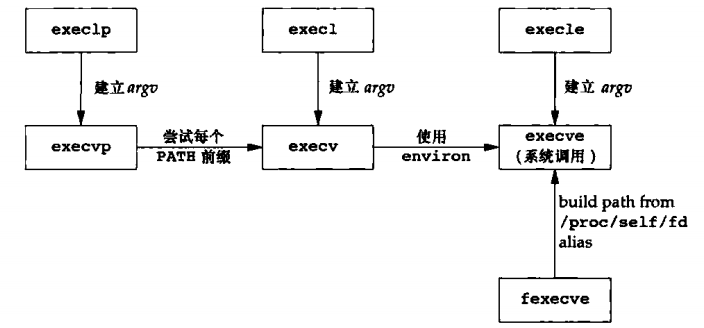

# 进程控制
## 进程控制
### 进程标识
每一个进程都有一个非负整数表示的唯一**进程ID**，因为进程ID总是唯一的，常将其用做作其他标识符的一部分以保证其唯一性。虽然唯一，但是可以复用，当一个进程终止后，其进程ID就成为复用的候选者，大多数系统实现延迟复用算法，使得赋予新建进程的ID不同于最近终止进程所使用的ID。
**ID为0的进程通常为调度进程，常被称为交换进程，该进程是内核的一部分，他并不执行任何磁盘上的程序，因此也称系统进程。ID为1的通常时init进程，在自举过程结束时有内核调用。**
除了进程ID外，每个进程还有其他标识符，介意通过下列函数获取：
```
#include <sys/types.h>
#include <unistd.h>
pid_t getpid(void);
						返回值：调用进程的进程ID
pid_t getppid(void);
						返回值：调用进程的父进程ID
uid_t getuid(void);
						返回值：调用进程的实际用户ID
uid_t geteuid(void);
						返回值：调用进程的有效用户ID
gid_t getgid(void);
						返回值：调用进程的实际组ID
gid_t getegid(void);
						返回值：调用进程的有效组ID
```
### fork函数
一个现有进程快同意调用`fork`函数创建一个新的进程。
```
#include <sys/types.h>
#include <unistd.h>

pid_t fork(void);
						返回值：子进程返回0，父进程返回子进程ID，出错返回-1
```
由`fork`创建的新进程被称为**子进程**，`fork`函数被调用一次，但是返回两次。两次返回的区别是子进程返回0，父进程返回新建子进程的进程ID。**将子进程ID返回给父进程的理由是**：因为一个进程可以有多个子进程，并且没有一个函数使一个进程可以获取其所有子进程的进程ID。**使子进程的返回值为0的理由是**：一个进程只会有一个父进程，所以子进程总是可以调用`getppid`以获取父进程的进程ID。

在fork之后处理文件描述符有以下两种常见的情况
1. 父进程等待子进程完成。在这种情况下，父进程无需对其描述符做任何处理。当子进程终止后，它曾进行过读、写操作的任何一共享描述符的文件偏移量已做了相应更新。
2. 父进程和子进程各自执行不同程序段。在这种情况下，fork之后父进程和子进程各自关闭他们不需要使用的文件描述符，这样就不会干扰对方使用的文件描述符。**这种方法时网络服务进程经常使用的。**

**子进程与父进程的区别**：
1. fork的返回值不同；
2. 进程ID不同；
3. 两个进程的父进程ID不同；
4. 子进程的`tms_utime`、`tms_stime`、`tms_cutime`、`tms_ustime`的值设置为0.
5. 子进程不继承父进程设置的文件锁；
6. 子进程的未处理闹钟被清除；
7. 子进程的未处理信号集设置为空集。

**fork失败的主要原因**：
1. 系统中已经有了太多的进程(通常意味着某个方面出了问题)；
2. 该实际用户ID的进程总数超过了系统限制。

**fork的用法**：
1. 一个父进程希望复制自己，使父进程和子进程同时执行不同的代码段。这在网络服务进程中时最常见的——父进程等待客户端的请求。当这种请求到达时，父进程调用fork，使子进程处理此请求。父进程等待下一个服务请求。
2. 一个进程要执行不同程序。这对于shell时常见的情况。在这种情况下，子进程从fork返回后立即调用exec。

### vfork函数
vfork函数的调用序列和返回值与fork相同。vfork函数用于创建一个新进程，而该新进程的目的是exec一个新程序。fork创建子进程后会执行写实复制，而vfork共享数据段，因此如果子进程修改数据、进行函数调用、或没有调用exec或exit就返回都可能带来未知的结果。

**vfork和fork的区别**

1. fork：子进程拷贝父进程的数据段、代码段；
vfork：子进程与父进程共享数据段；
2. fork：父子进程的执行次序不确定；vfork：保证子进程先运行，在调用exec或exit之前与父进程数据时共享的，在调用exec或exit之后父进程才能被调度运行，因此，如果在调用这两个函数之前子进程依赖于父进程的进一步动作，则会导致死锁。

### exit函数
**进程终止方式**
+ **正常终止**
    1. 在main函数内执行return语句；
    2. 调用exit函数。此函数有ISO C定义，其操作包括调用各终止处理程序(终止处理程序在调用atexit函数时登记)，然后关闭所有标准IO流；
    3. 调用_exit或_Exit函数。他们它们并不冲洗标准IO流。
    4. 进程的最后一个线程在其启动例程中执行return语句。但是该线程的返回值不用作进程的返回值。当最后一个线程从其启动例程返回时，该进程以终止状态0返回。
    5. 进程的最后一个线程调用pthread_exit函数。这种情况下，进程的终止状态总是0.
+ **异常终止**
    1. 调用abort。它产生SIGABRT信号。
    2. 当进程接收到某些信号时。信号由进程自身(如调用abort函数)、其他进程或内核产生(如：进程应用地址空间之外的存储单元、或除以0内核都会为该进程产生相应的信号)。
    3. 最后一个线程对“取消”请求做出响应。
    
**终止进程通知其父进程自身终止状态的方法**：对于3个终止函数(exit,_exit,_Exit)，实现这一点的方法是，将其退出状态作为参数传递给函数。在异常终止情况下，内核产生一个指示其异常终止原因的终止状态。任意一情况下，该终止进程的父进程都能用wait和waitpid函数取得其终止状态。
**父进程在子进程之前终止**：父进程在子进程之前终止，它们的父进程会变为init进程。也可称**由init进程收养**。其过程大致为：在一个进程终止时，内核逐个检查所有活动进程，以判断它是否正要终止进程的子进程，如果是，则该进程的父进程ID就更改为1(init进程的ID)。
**子进程在父进程之前终止**：内核为每个终止子进程保存了一定量的信息，所以当终止进程的父进程调用wait或waitpid时可以得到这些信息。
**wait或waitpid获得的信息**：进程ID、该进程的终止状态以及该进程使用的CPU事件总量。内核可以释放终止进程所使用的所有存储区，关闭所有打开的文件。
**僵死进程**：一个已经终止，但是其父进程尚未对其进行善后处理(获取终止进程的有关信息，释放它仍占用的资源)的进程。
**init进程收养的进程终止时不会变成僵死进程**：因为init被编写成无论何时只要有一个子进程终止，init就会调用一个wait函数获取其终止状态。
**init的子进程**可能是由它自身自己产生，也可是是其父进程已终止由init收养的进程。

### wait和waitpid函数
当一个进程正常或异常终止时，内核就向其父进程发送SIGCHLD信号。因为子进程终止是一个异步事件，所以这种信号也是内核向父进程发的异步通知。
**调用waitpid或wait的进程可能会发生**：
1. 如果其所有子进程都还在运行，则阻塞；
2. 如果一个子进程已终止，正等待父进程获取其终止状态，则取得该子进程的终止状态立刻返回；
3. 如果它没有任何子进程，则立即返回出错。

如果进程由于接收到SIGCHLD信号而调用wait，则wait会立即返回，但是如果在随机事件点调用wait，则进程可能会阻塞。
```
#include <sys/types.h>
#include <sys/wait.h>

pid_t wait(int *wstatus);
pid_t waitpid(pid_t pid, int *wstatus, int options);
							返回：若成功，返回进程ID；若出错，返回0或-1;。
```
**两个函数的区别**：
1. 在一个子进程终止前，wait使其调用者阻塞，而waitpid有一选项可使调用者不阻塞。
2. waitpid并不等待在其调用之后的第一终止子进程，他有若干选项可以控制所等待的进程。

参数`wstatus`时一个整形指针，若不是空指针，则终止进程的终止状态就存放在它所指的单元内。若不关心终止状态，则可将该参数指定为空指针。
参数`pid`其作用如下：
1. pid = =  -1 ：等待任一子进程。此情况下，waitpid与pid等效。
2. pid < -1： 等待组ID等于pid绝对值的任一子进程。
3. pid = =  0 ： 等待组ID等于调用进程组ID的任一子进程。
4. pid > 0 ：等待进程ID与pid相等的子进程。

**waitpid提供wait没有的3个功能**：
1. waitpid可等待一个特定的进程，而wait则返回任一终止子进程的状态。
2. waitpid提供一个wait的非阻塞版本。
3. waitpid通过WUNTACED和WCONTINUED选项支持作业控制。

### 竞争条件
当多个进程都企图对共享数据进行某种处理，而最后的结果又取决与进程运行的顺序时，我们认为发生了**竞争条件**。如果在fork之后的某种逻辑显式或隐式的依赖于在fork之后是父进程先运行还是子进程先运行，那么fork函数就会是竞争条件活跃的滋生地。
为了**避免竞争条件和轮询**，在多个进程之间需要有某种形式的信号发送和接收的方法。可以各种形式的进程间通信机制。

### exec函数
用fork函数创建新的子进程后，子进程往往要调用一种exec函数以执行另一程序。当调用一种exec函数时，该进程执行的程序完全替代为新程序，而新程序则从其main函数开始执行。因为调用exec并不创建新进程，所以前后的进程ID并未改变。exec只是用磁盘上的一个新程序替代了当前进程的正文段、数据段、堆段和栈段。
```
#include <unistd.h>
extern char **environ;
int execl(const char *path, const char *arg, ... /* (char  *) NULL */);
int execv(const char *path, char *const argv[]);
int execle(const char *path, const char *arg, ... /*, (char *) NULL, char * const envp[] */);
int execve(const char *path, char *const argv[], char *const envp[]);
int execlp(const char *file, const char *arg, .../* (char  *) NULL */);
int execvp(const char *file, char *const argv[]);
int execvpe(const char *file, char *const argv[], char *const envp[]);
int fexecve(int fd, char *const argv[], char *const envp[]);
```
这些函数之间的**第一个区别**时前4个函数取路径名作为参数，后3个函数则取文件名作为参数，最后一个取文件描述符作为参数。当指定`file`作为参数时：

+ 如果`file`中包含/，则就将其视为路径名；
+ 否则就按`PATH`环境变量，在它所指定的个目录中搜索可执行文件。

**第二个区别**与参数表的传递有关(l表示list，v表示vector)。函数execl、execlp、execle要求将新程序的每个命令行参数都说明为一个单独的参数。这种参数表以空指针结尾。而另外加几个函数(execv、execvp、execve、execvpe、fexecve)，则先构造一个指向各参数的指针数组，然后将该数组地址作为这几个函数的参数。
**第三个区别**与新程序传递环境表相关。以e结尾的几个函数可以传递一个指向环境字符串指针数组的指针。其余函数则使用调用进程中的environ变量为新程序复制现有的环境变量。

几个exec函数之间的关系


